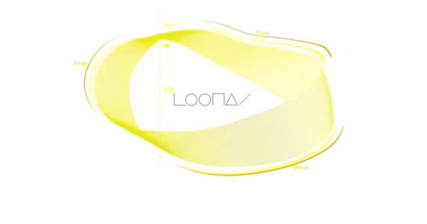

# The LOONAverse. 
## A website analyzing the Loonaverse

### WHAT IS THE LOONAVERSE?

Semi-popular k-pop band LOONA is the origin of the Loonaverse, a in music video lore storyline committed to over a 12 music video project to start with and a continuing storyline based off of this original plot. To introduce someone to the Loonaverse, first, you must introduce the 3 subunits - Loona 1/3, who's lore is based in our reality, Loona OEC, who lives in "Middle Earth", which is like Earth but more hallucinations, and YYXY, who lives in a mysterious place called Eden that everyone who lives there hates and wishes to escape. 

These 3 units come together to form a team who are forced to "save the world," or, I think. This is a really confusing subject. They live on a **mobius strip**, and all their adventures are held on this strip. 

### INTRODUCING THE SUB-UNITS

#### LOONA 1/3

LOONA 1/3 consists of members Heejin, Hyunjin, Vivi, and Haseul, with honorary member Yeojin (she was too young to take part of the project initially.) These five had their albums released first, and are the set-up to what the Loonaverse is. All coming from different places on Earth (in lore, that is.), each member represents a different animal, place, fruit, and such. 

**HEEJIN - ViViD** 
 
 Heejin's Vivid marks the start of the Loonaverse, and makes her the creator of all of the Looonaverse. In story, she is a parallel to Olivia Hye, and the most important character for the beginning arc of the story, as she creates the world and basically disappears. This is like salutary neglect, like what the British did to the Americans. Her color is white, and she represents purity, as her animal is a bunny. In her music video, Heejin makes colors appear and life more ViViD.
 
 Personally, I would rate ViVid a solid 7.5/10, and 9th out of the 12 songs. 
 
 Listen to [ViViD](https://www.youtube.com/watch?v=-FCYE87P5L0)
 
 **HYUNJIN - AROUND YOU**

Hyunjin's Around You has a lot of cat heads. I cannot tell you what happens, honestly, but there's a lot of cats. She bonds with cats and gets a bracelet from a cat. She really likes cats. It's a cute cat, to be far. 

I rank this 11 out of 12. 

Listen to [Around You](https://www.youtube.com/channel/UCOJplhB0wGQWv9OuRmMT-4g)

**HASEUL - LET ME IN**

This is one of the best songs in existence. She shoots a bird, and somehow it turns into a feather. But it's so classy. The vibes are so nice. She canonically is the coolest person in the Loonaverse. 

This is a 2 out of 12. I'm sorry, Let Me In. 

Listen to [Let Me In](https://www.youtube.com/watch?v=6a4BWpBJppI) 

**ViVi - EDILY**

The cutest song in this series. But it's also about amnesia and robots. It's like gundam but with real people, I think. It's not very clear. I honestly have no idea what happens but she works in a store and sells tapes so that's cute. 

This is a 12/12.

Listen to [EDILY](https://www.youtube.com/watch?v=ZNcBZM5SvbY)

#### YEOJIN 

Yeojin, at the time of the LOONA project, was only 14, so she could not debut because of school. Therefore, she is not part of the aformentioned LOONA 1/3 or the next group called Odd Eye Circle (They literally have odd circles in their eyes.) Yeojin, however, still had a solo album, and was the 4th debuted member, but was unable to promote it like the other members. However, it may be the most iconic song on this list. 

**YEOJIN - KISS LATER**
 
 Yeojin's Kiss Later is funky. It's fresh. It's everything good about the world. It's rainbows and sunshine. There's a person with a frog head. It's glorious. It's amazing. It's the best song ever. 
 
 I rank this a 10/12. 

Listen to [Kiss Later](https://www.youtube.com/watch?v=thpTOAS1Vgg)

#### ODD EYE CIRCLE

ODD EYE CIRCLE, otherwise known as OEC, are the anime protagonists of the LOONAVERSE. Made up of Kim Lip, Choerry, and Jinsoul, they represent the funky fresh in the LOONAVERSE. They live in the Middle Earth, and are each strongly connected to a color - Choerry to Purple, Kim Lip to Red, and Jinsoul to Blue. You may ask, why is it almost the primary colors, but not exactly? The anwer is easy. Kidnapping. 

**KIM LIP - ECLIPSE**

Eclipse truly changed the world. However, to go over the lore, Kim Lip is basically the Naruto in this universe. She's super powerful, good at running, and good at crying. Kim Lip is trying to save the mooon which is about to be destroyed, I think, and therefore, starts getting people to run, I think, so I guess they can have their runnning power the moon. And therefore, they won't die. 

Eclipse is a solid 4/12. 

Listen to [Eclipse](https://www.youtube.com/watch?v=_qJEoSa3Ie0)

**JINSOUL - SITR**

Jinsoul's kind of evil in the LOONAVERSE. She kills ViVi and turns her into a robot, but thankfully, ViVi manages to shake it off. She kidnaps Choerry from an alternate universe because her friend abandons her and she's sad, and uproots Choerry's entire life. It's kind of interesting. She makes Olivia Hye go insane, basically. In her music video, she's stuck in a fish tank. She looses an eye, I think. 

Solid 5/12. 

Listen to [SITR](https://www.youtube.com/watch?v=RWeyOyY_puQ)

**CHOERRY - LCM**

Love Cherry Motion depicts Choerry being kidnapped to another world, and therefore, having to adjust to life there. She's away from her friends because she ate cake which had bad things which got her kidnapped, and she's super happy but also sad. 

I love this song. This is a solid 8/12. 

Listen to [LCM](https://www.youtube.com/watch?v=VBbeuXW8Nko)

####YYXY 

YYXY is the best subunit, unbiasedly. They are so much fun. Chuu, Yves, Olivia Hye, and Gowoon live together in a bording school in the middle of nowhere called Eden with no contact with anyone. It's terrifying. There's a lot of gory, weird stuff, so it'll be skipped over. They all love one girl named Yves in different ways, but Yves ends up doiong something that betrays one girl specifically - Olivia Hye. 

**YVES - NEW**

Yves, feeling constrained, escapes from Eden for one day. She steals the key froom the warden (shown in Love4Eva, which, by the way, has a Grimes feature on it, haha,) and runs off into the world until she finds Hong Kong, where she meets ViVi. With ViVi, she has fun until ViVi falls in love with her, but by then, Yves has to leave. New depicts her emotions towards the new world after being held captive for so long, as she smashes apples and hits stuffed animals - she's depicted playing games with the 12 girl's animals, making her seem like a mastermind, almost more evil than Jinsoul, as she goes and does bad stuff. 

This is a solid 6/12. 

Listen to [New](https://www.youtube.com/watch?v=LIDe-yTxda0)

**CHUU - HEART ATTACK** 

Heart Attack is sang by Chuu, who, in lore, is in love with Yves. She wants Yves to notice her, and tries to get her attention - her song focuses on love and obsession, as she becomes obsessed with Yves to the point she doesn't think about anything else and will do anything Yves will tell her to, even if that means abandoning her closest friends. Yves, throuhgout the song, ignores Chuu, and basically treats her kind of badly, until the end, where Yves accepts her love and feeds her a strawberry - but we learn that this is actually a way to get her to leave Eden with her. Basically, for the YYXY girls to leave Eden, they have to eat a berry and an apple, which happens throughout the songs in a subtle way. So, Chuu doesn't realize this, and thinks Yves actually loves her. 

This is a 7/12, but also has one of the best songs ever as a B-side, Girl's Talk. 

Listen to [Heart Attack](https://www.youtube.com/watch?v=BVVfMFS3mgc)
Listen to [Girl's Talk](https://www.youtube.com/watch?v=FqR1bNjFyyw)

**GOWON - ONE AND ONLY** 

One and Only is a rap infused song (not really rap, but. You know.) sang by Gowon. Gowon, in lore, is represented by the butterfly and important in ways that are not seen yet, because of the ongoing lore. She's in love with Olivia Hye, until they break up when she starts to act cold to Olivia Hye because she thinks she cannot trust her with the secret that her, Yves, and Chuu are going to leave Eden. In her song, the OEC members are chasing her and trying to get her to eat a pineapple - her fruit - so she can leave Eden, but she doesn't understand. In her view, Yves is amazing because she helped her become less anxious, and therefore, decides to try and leave on her request. 

This is a 3/12. 

Listen to [One&Only](https://www.youtube.com/watch?v=m5qwcYL8a0o)

**OLIVIA HYE - EGOIST**

Perhaps one of the best songs, ever, Egoist is centered around egotistical, self-hating, angry, Olivia Hye. Her three friends left her in Eden to othe abuse of the patrons by herself, and in her eyes, that was the biggest betrayal possible - in her hatred, Olivia Hye eats a blood plum left by Yves for Olivia Hye in case she ever wanted to leave, she leaves Eden. Jumping from area to area and sleeping in garages, Olivia tries to find her friends to show them her anger, but in the song, she sloowly develops a sense of letting go but also loving herself, and accepts that her friends kind of suck, but that's ok. She eventually meets them and hugs them, and also hugs Heejin - representing the end of the cycle of the 12 girls. 

THIS IS A 1/12!!! 

Listen to [Egoist](https://www.youtube.com/watch?v=UkY8HvgvBJ8)

